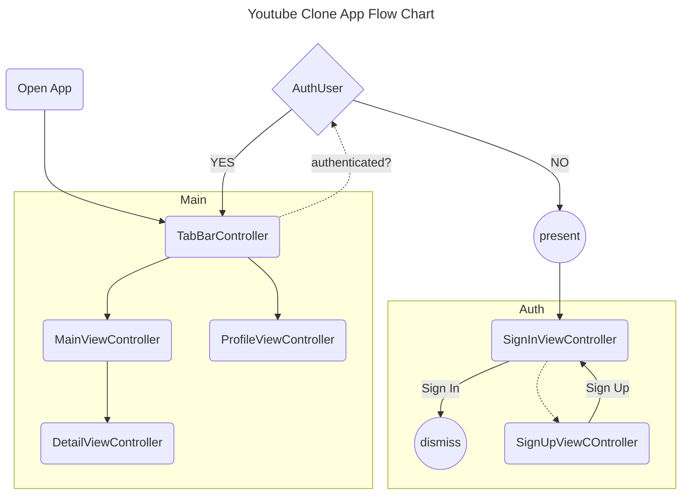
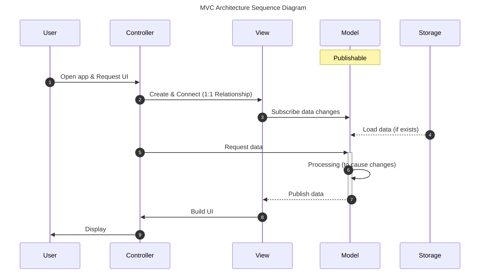
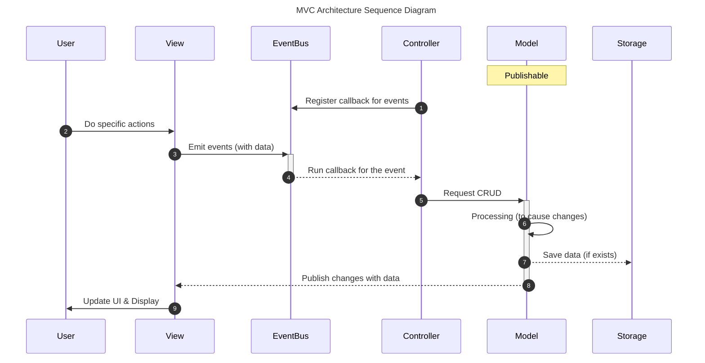

# Youtube Clone App <!-- omit from toc -->

Simple Youtube Clone App built with UIKit. It uses the Youtube API to fetch videos and display them in a list.

---

## Development <!-- omit from toc -->

Clone this repository and open `YoutubeCloneApp.xcodeproj` with [Xcode](https://developer.apple.com/xcode/).

### Setting API Keys <!-- omit from toc -->

1. Change directory to the project root.
   ```bash
   $ cd /path/to/youtube-clone-app
   ```
2. Run the `setup.sh` script.
   ```bash
   $ ./scripts/setup.sh
   Enter your Youtube API key: <insert your API key here>
   Setup complete!
   ```

---

## 프로젝트 소개

### 이번 프로젝트의 목표

1. 코드로 UI 작성하는 방법에 익숙해지기 (StackView)
2. MVC Architecture에 대해 깊이 이해하기
3. 모델 간 데이터 및 이벤트 전달 흐름을 이해하기 (Observer 패턴)
4. PullToRefresh, Infinite Scrolling 구현해보기
5. 입력폼 유효성 검증 (정규 표현식)

### [와이어프레임](https://www.figma.com/file/s5CcH60auYpww3C7uYW1VM/Youtube-App-Clone?type=design&node-id=0%3A1&mode=design&t=AHbFhWPuaraYByxq-1)

Figma에서 제공하는 Auto Layout 기능을 적용. UI를 작성할 때 StackView를 활용하여 동일하게 구현.

**로그인 페이지 (김도윤)**

- 이메일, 비밀번호를 입력받아 UserDefaults가 가지고 있는 사용자 데이터와 비교하여 로그인 성공/실패 결정

**회원가입 페이지 (김도윤)**

- 프로필 사진, 이름, 이메일, 비밀번호를 입력 받아 UserDefaults에 사용자 정보 저장
- 정규표현식을 활용한 입력폼 유효성 검증 기능 제공 (이메일, 패스워드)

**메인 페이지 (김지훈)**

- 유튜브 영상 목록을 표시
- PullToRefresh 기능 제공
- Infinite Scrolling 기능 제공

**상세 페이지 (장가겸)**

- WkWebView를 활용한 유튜브 플레이어 제공
- 댓글 기능 제공 (UserDefaults)

**마이 페이지 (이애라, 박진용)**

- 로그인한 사용자의 정보 확인 및 수정 기능 제공
- ~~찜하기 기능~~

## 프로젝트 시연 및 설명

[View on Youtube](https://youtu.be/iuUxibz0reQ)



## MVC Architecture

### MVC 계층 간 역할을 어떻게 하면 완벽하게 분리할 수 있을까?

**Controller**

- Controller는 View가 UI를 그릴 수 있도록 데이터를 전달
- 사용자로부터 이벤트(탭, 입력 등)가 발생했을 때 특정 비즈니스 로직 수행

**View**

- 주어진 데이터를 기반으로 UI를 그리는 역할만 수행
- 사용자가 UI를 통해 특정 액션을 취했을 때 Controller에게 알릴 수 있어야 함
- 비즈니스 로직을 포함하지 않도록 주의해야 함

**Model**

- `Model` Codable한 데이터 모델. 네트워크 혹은 UserDefaults에 저장할 수 있는 형식으로 변환 (JSON)
- `ViewModel` Model을 정리하여 비즈니스 로직에서 사용할 수 있는 형태로 재작업한 모델. UI 플랫폼 독립적으로 구현 (extension을 활용하여 각 플랫폼에 맞는 형식으로 변환 후 제공)
- `Service`  ViewModel에 대해 CRUD 기능 제공 (UserDefaults 포함)

**프로젝트 구조**

```
 ./
 ├── Resources/
 ├── Utilities/
 ├── Models/
 ├── ViewModels/
 ├── Services/
 ├── Views/
 │  ├── Shared/
 │  ├── SignInView/
 │  ├── SignUpView/
 │  ├── HomeView/
 │  ├── DetailView/
 │  ├── ProfileView/
 │  └── RootView.swift
 ├── Controllers/
 │  ├── Shared/
 │  │  ├── PhotoPicker.swift
 │  │  └── TypedViewController.swift
 │  ├── RootViewController.swift
 │  ├── SignUpViewController.swift
 │  ├── SignInViewController.swift
 │  ├── HomeViewController.swift
 │  ├── DetailViewController.swift
 │  └── ProfileViewController.swift
 └── Info.plist
 ```

🔥 **문제점**

1. UIKit에서는 ViewController에서 View와 Controller를 분리하기 어려움
2. View에서 특정 액션이 벌어졌을 때 Controller에게 전달할 수 있는 방법
    1. Delegate 활용: delegate를 추가할 때마다 코드가 길어지고 관리하기 어려워짐
    2. Closure 활용: 내부에서 self를 사용할 때 `[weak self]` 혹은 `[unowned self]`를 깜빡할 때가 있고 강한 순환 참조 결합이 발생하지 않도록 주의해야 함 → 주의하며 작성했으나 `deinit`이 되지 않는 문제가 발생
3. Model 데이터(상태)가 변경됐을 때, 이를 View에게 알릴 수 있는 방법이 복잡함 → View는 Model과 직접적으로 연결되지 않았으므로 Controller를 거쳐야 함.


### MVC 계층 간 역할을 정확히 분리하고, 이벤트 흐름을 만들기 위한 방법

1. [`RootView`](/YoutubeCloneApp/Views/RootView.swift) & [`TypedViewController`](/YoutubeCloneApp/Controllers/Shared/TypedViewController.swift) 적용
    - `UIViewController` 가 가진 `view` 속성을 대체할 `RootView` 정의
        
        ```swift
        // RootView.swift
        protocol RootView: UIView {
            func initializeUI()
        }
        ```
        
    - RootView를 generic 타입으로 받아 `loadView` 함수 내에서 `view` 속성을 교체
        
        ```swift
        // TypedViewController.swift
        class TypedViewController<View: RootView>: UIViewController {
            var rootView: View { view as! View }
        
            override func loadView() { // view 인스턴스를 생성하는 라이프 사이클 함수
                // super.loadView() <- 인스턴스를 직접 생성할 것이므로 호출하면 안 됨
                view = View()
            }
        
            override func viewDidLoad() {
                super.viewDidLoad()
                // view의 타입은 UIView이므로, initializeUI를 호출할 수 없음
                rootView.initializeUI() // RootView는 initializeUI를 필수 구현하므로 실행 가능
            }
        }
        ```
        
    - `SignInView` 에서 모든 UI를 작성하고 `SignInViewController` 에서는 비즈니스 로직만 포함
        
        ```swift
        // 사용법
        final class SignInView: UIView, RootView { ... } // RootView 채택 필요
        
        final class SignInViewController: TypedViewController<SignInView> {
        	  override func viewDidLoad() {
                super.viewDidLoad()
        
        				rootView; // SignInView 타입
            }
        }
        ```
        
2. [`EventBus`](/YoutubeCloneApp/Utilities/EventBus.swift) 유틸리티 클래스 적용
    - 이벤트를 관리하며, 구독 및 발행 기능을 제공합니다. 이벤트 기반의 프로그래밍 패턴을 제공합니다.
        ```swift
        // Controllers/DetailViewController.swift
        struct AddCommentEvent: EventProtocol {
            struct Payload {
                let content: String
                let completion: (Comment) -> Void
            }
    
            let payload: Payload
        }
    
        // Controllers/DetailViewController.swift
        EventBus.shared.on(AddCommentEvent.self, by: self) { listener, payload in
            guard let video = listener.video, let user = AuthService.shared.user else { return }
            CommentService.shared.add(comment: payload.content, to: video, by: user, payload.completion)
        }
    
        // Views/DetailView.swift
        EventBus.shared.emit(AddCommentEvent(
            payload: .init(content: comment) { comment in
                // ... 
            }
        ))
        ```
    
3. [`Publishable`](/YoutubeCloneApp/Utilities/Publishable.swift) Property Wrapper 클래스 적용
    - 속성값의 변경사항을 구독자에게 자동으로 알려주는 Property Wrapper 클래스입니다.
        ```swift
        // ViewModels/User.swift
        final class User {
            @Publishable var avatar: Base64?
            @Publishable var name: String
            @Publishable var email: String
            var password: String
   
    		    // ...
        }
    
        // Views/ProfileView.swift
        user?.$email.subscribe(by: self, immediate: true) { subscriber, changes in
            subscriber.emailTextField.text = changes.new
        }
        ```

**강한 참조 결합 문제는?**

```swift
struct WeakRef<T: AnyObject> {
    weak var value: T?
    init(_ value: T?) {
        self.value = value
    }
}
```

→ `EventBus` 와 `Publishable` 모두 내부적으로 `self` 인스턴스를 `WeakRef`로 관리하여 강한 순환 참조 결합 문제를 해결했습니다. 발행할 때마다 확인하여 `value`가 `nil` 이라면 구독 목록에서 제거합니다.

### **Scenario** #1 사용자가 앱을 접속했을 때 (UI 요청)



1. User가 앱을 실행하고 UI를 요청하면,
    1. Controller가 View를 생성하고 자신에게 연결합니다. ([`TypedViewController`](/YoutubeCloneApp/Controllers/Shared/TypedViewController.swift))
    2. View를 생성하는 단계에서 Model의 변경사항을 구독합니다. ([Publishable](https://github.com/nbcamp/to-do-list#publishable))
    3. Storage로부터 데이터를 불러와 Model을 준비합니다.
2. Controller는 UI를 그리기 위해 필요한 데이터를 Model에 요청합니다.
3. Model은 필요한 데이터를 정리하여 View에게 발행합니다. View는 이를 토대로 UI를 구축합니다.
4. View와 연결된 Controller를 통해서 사용자에게 UI를 보여줍니다.

### **Scenario** #2 사용자가 UI를 조작했을 때 (특정 액션)



1. Controller가 생성되는 과정에서 특정 이벤트에 실행할 동작을 정의합니다. ([EventBus](https://github.com/nbcamp/to-do-list#eventbus))
2. User가 View를 통해 특정 행동을 수행하면 EventBus에 등록된 이벤트를 발행합니다.
3. 해당 이벤트를 구독 중인 Controller는 이벤트를 받아 데이터 생성/변경/삭제를 Model에게 요청합니다.
4. Model은 요청에 맞게 데이터를 적절히 처리한 후, 변환하여 Storage에 저장합니다.
5. Model은 변경사항을 데이터와 함께 구독 중인 View에게 알립니다. View는 이를 토대로 UI를 변경합니다.
6. View와 연결된 Controller를 통해서 사용자에게 UI를 보여줍니다.

## 트러블 슈팅

**API Key 관리 (Environment Variables)**

- #첫번째 시도: Secrets.xcconfig 파일에서 관리
    1. `Resources` 폴더 아래 `Secrets.xcconfig`를 생성. (`.gitignore` 추가)  YOUTUBE_API_KEY 추가
        ```bash
        YOUTUBE_API_KEY =
        ```
    2. 프로젝트 설정에서 Configuration에서 Secrets.xcconfig 등록
    3. Info.plist에 YOUTUBE_API_KEY 환경변수를 등록하고, Bundle에 접근하여 가져와 사용
        ```swift
        var API_KEY: String = (Bundle.main.object(forInfoDictionaryKey: "Secrets") as? [String: String])?["YOUTUBE_API_KEY"] ?? ""
        ```
    🔥 **문제점**
    
    1. Secrets.xcconfig가 .gitignore에 등록되어 있어 원격저장소에는 안 올라가지만, project.pbxproj 파일에는 등록되어 저장소를  클론할 때마다 파일을 새로 생성해야 하고, 또 Configuration에 등록해야 함.
    2. Configuration 과정을 수행하면서 project.pbxproj 파일이 변경됨 (불필요한 변경 내역 생성 및 충돌 야기)
    3. Secrets.xcconfig가 아니라 이름에 오타라도 발생하면 gitignore가 안되서 저장소에 노출될 위험이 있음
    
- #두번째 시도: Script를 활용하여 빌드할 때 바꿔치기
    >project.pbxproj의 관리에서 벗어나기 위해 환경변수 관리 파일을 Root Directory에 추가해야 함
    - [`.env.example`](/.env.example) 파일 추가 (`.env` 파일 gitignore에 추가)
    - [`scripts/setup.sh`](/scripts/setup.sh) 파일 추가 (실행 시 API Key를 물어보고 입력을 기반으로 `.env` 파일 생성)
    - xcode의 scheme에서 build 시 실행할 스크립트 등록 (pre-actions, post-actions)
        - [`prebuild.sh`](/scripts/prebuild.sh): Env.swift에 접근하여 `.env` 파일에 등록된 환경변수로 교체
        - [`postbuild.sh`](/scripts/postbuild.sh): Env.swift에 접근하여 원래 값으로 교체

    ⚠️ **문제점**
    
    1. 빌드 진행 중 실패하면 post-action이 실행되지 않음 → 빌드 실패했는데 커밋하지 마세요.
    2. Env.swift 파일을 연 채로 빌드를 수행하면 가끔 쓰기가 제대로 수행되지 않음 → 열지 마세요.
